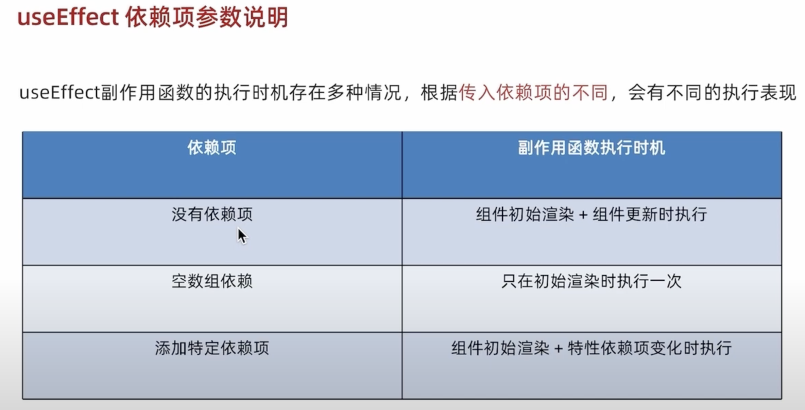
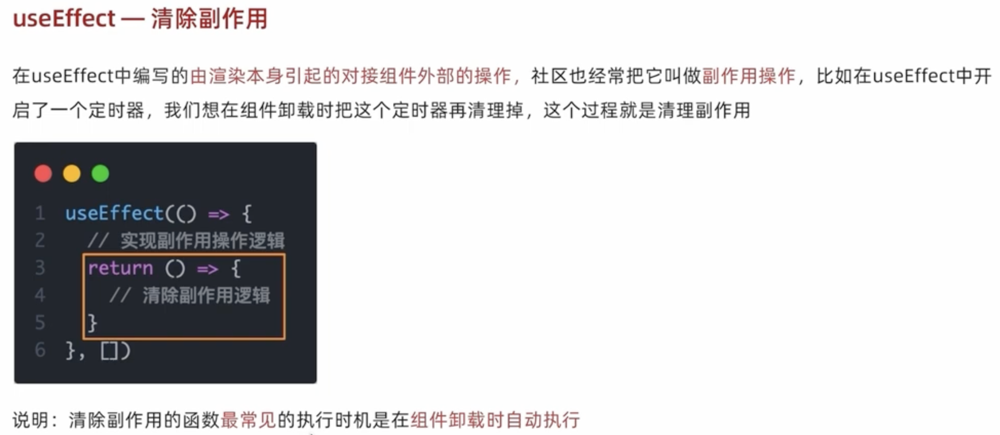
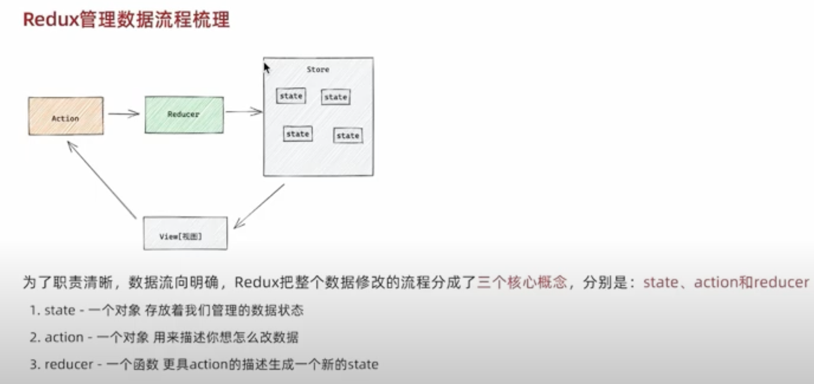

## useEffect



```js

const UseEffectCom = () => {
  const [value, setValue] = useState(0)
  // 1. 不传依赖项
  useEffect(() => {
    // 1.初始化被调用
    // 2.组件状态更新被调用
    console.log('无依赖项 useEffect 被调用')
  });

  // 2.传空数组
  useEffect(() => {
    console.log('只在初始化时调用')
  }, [])

  // 3.传入依赖项
  useEffect(() => {
    console.log('value 值变更了')
  }, [value])
  return (<div>
    <p>{value}</p>
    <button onClick={() => setValue(value + 1)}>+</button>
  </div>)
}
```

## 清除副作用



```js

const ClearEffect = () => {
  const [ count, setCount] = useState(0);

  useEffect(() => {
    let timer = setInterval(() => {
      setCount(count + 1);
      console.log('倒计时启动')
    }, 1000)

    return () => {
      clearInterval(timer);
    }
  })
  return (<div>
    clear
  </div>)
}
```

## 自定义 hook

```js

const useToggle = (visible = true) => {
  const [value, setValue] = useState(visible);

  const toggle = () => setValue(!value);

  return {
    value,
    toggle
  }
}

const CustomHookCom = () => {
  const { value, toggle } = useToggle(true);
  return (<div>
    { value && <div>是否可见</div> }
    <button onClick={toggle}>切换</button>
  </div>)
}

```

## redux

