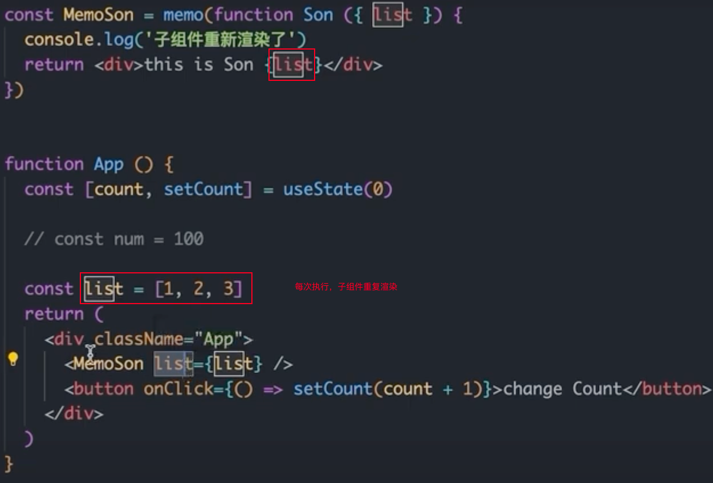
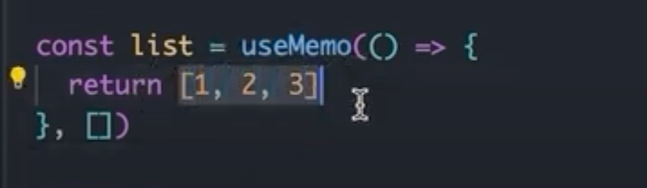
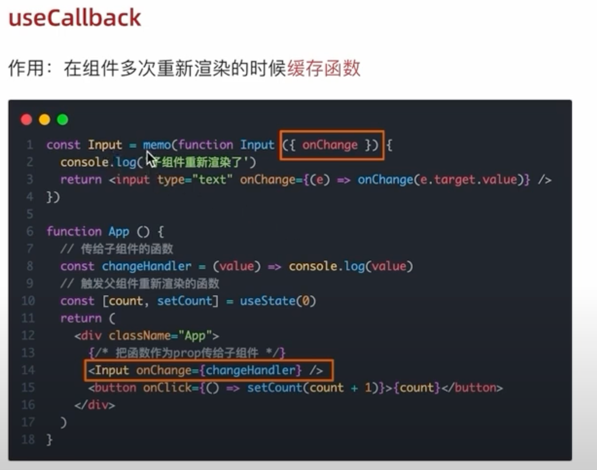
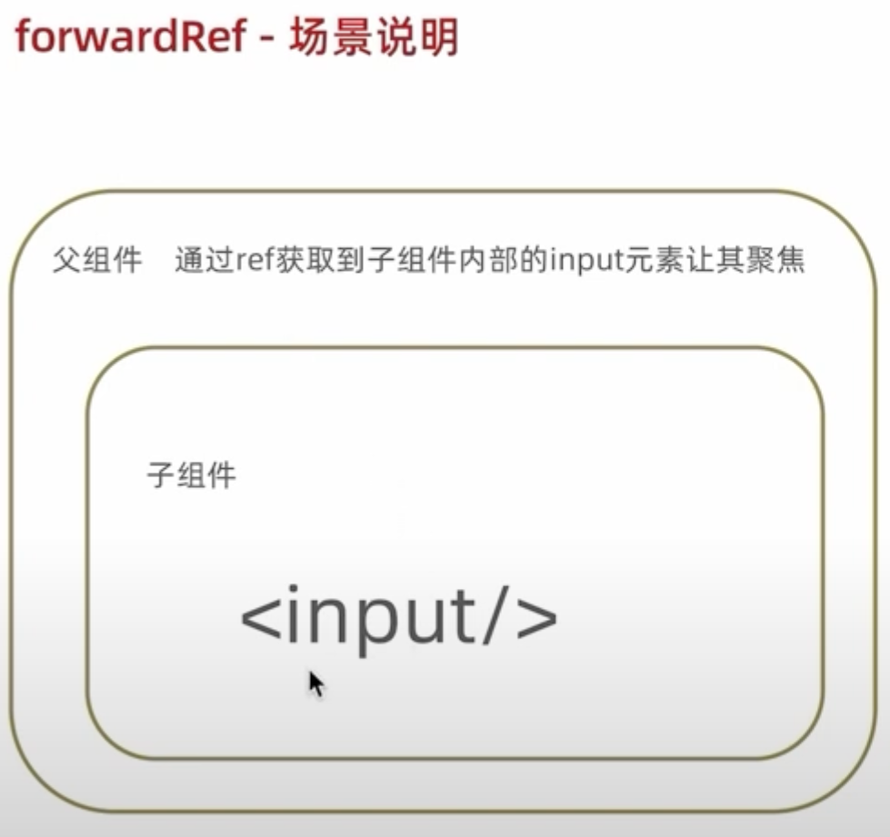
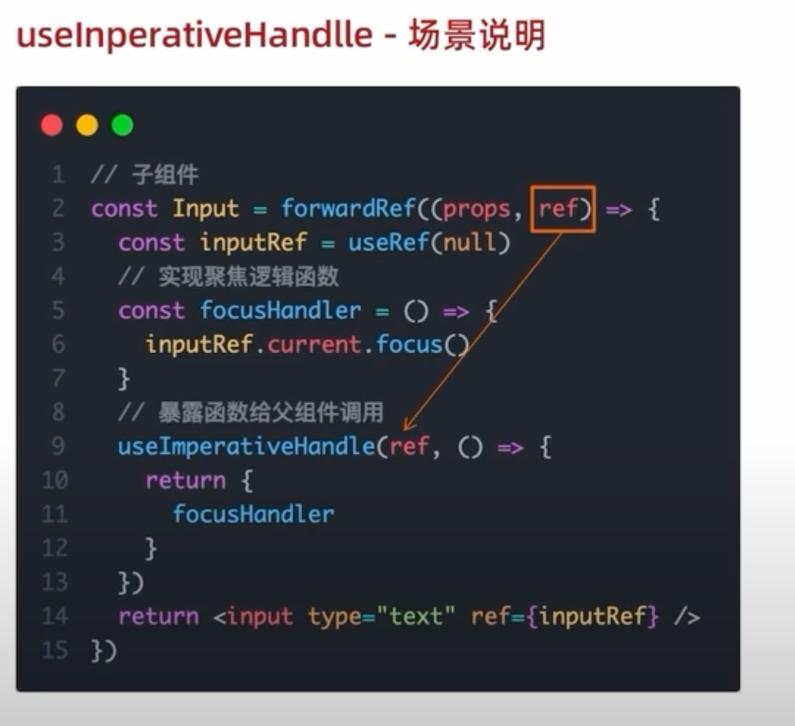
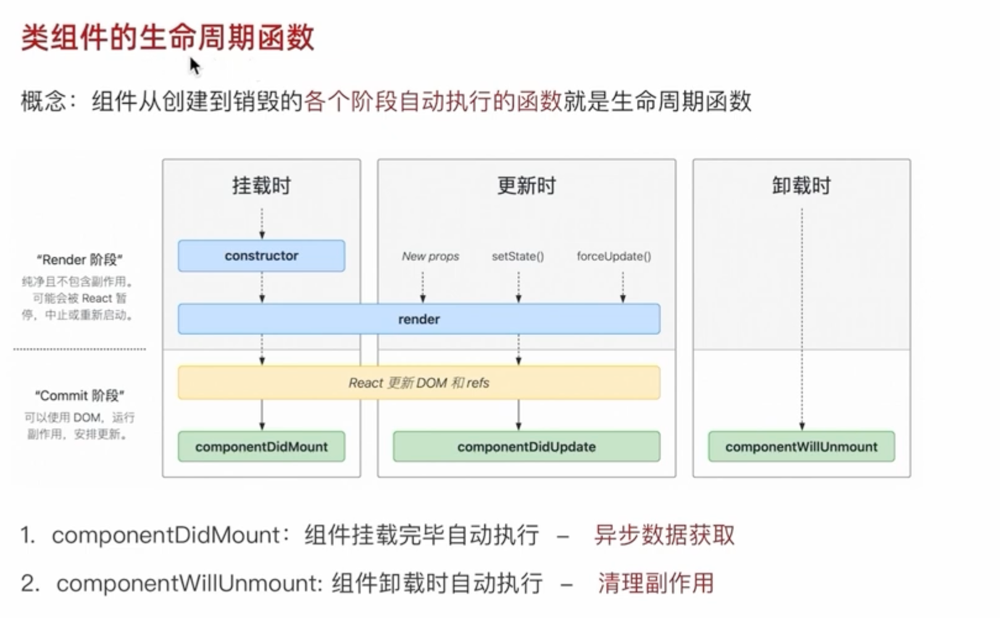
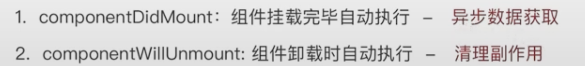
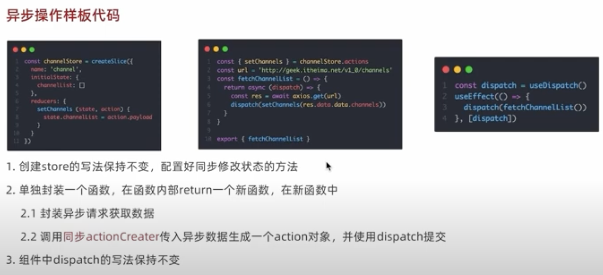
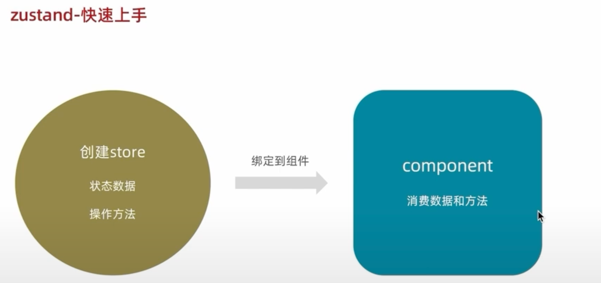
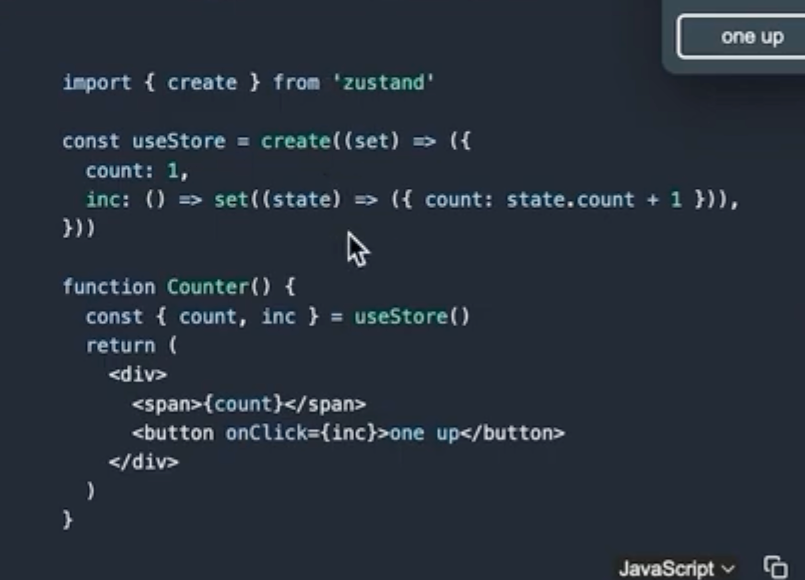

## useEffect


```js

const UseEffectCom = () => {
  const [value, setValue] = useState(0)
  // 1. 不传依赖项
  useEffect(() => {
    // 1.初始化被调用
    // 2.组件状态更新被调用
    console.log('无依赖项 useEffect 被调用')
  });

  // 2.传空数组
  useEffect(() => {
    console.log('只在初始化时调用')
  }, [])

  // 3.传入依赖项
  useEffect(() => {
    console.log('value 值变更了')
  }, [value])
  return (<div>
    <p>{value}</p>
    <button onClick={() => setValue(value + 1)}>+</button>
  </div>)
}
```

## 清除副作用


```js

const ClearEffect = () => {
  const [ count, setCount] = useState(0);

  useEffect(() => {
    let timer = setInterval(() => {
      setCount(count + 1);
      console.log('倒计时启动')
    }, 1000)

    return () => {
      clearInterval(timer);
    }
  })
  return (<div>
    clear
  </div>)
}
```

## 自定义 hook

```js

const useToggle = (visible = true) => {
  const [value, setValue] = useState(visible);

  const toggle = () => setValue(!value);

  return {
    value,
    toggle
  }
}

const CustomHookCom = () => {
  const { value, toggle } = useToggle(true);
  return (<div>
    { value && <div>是否可见</div> }
    <button onClick={toggle}>切换</button>
  </div>)
}

```


## useReducer


```js
// useReducer

import { useReducer } from "react";

// 1. 定义 reducer 函数
function reducer(state, action) {
  switch(action.type) {
    case 'INC':
      return state + 1;
    case 'DESC':
      return state - 1;
    default: return state
  }
}


const Board = () => {
  // 2.组件中使用useReducer
  const [state, dispatch] = useReducer(reducer, 0)
  return (<div>
    board: { state }<br/>
    <button onClick={ () => dispatch({type: 'INC'})}>+1</button><br/>
    <button onClick={ () => dispatch({type: 'DESC'})}>-1</button><br/>
  </div>)
}

export default Board;
```

## useMemo 


```js
import { useMemo, useState } from "react";

const fib = (n) => {
  if(n < 3) return 1
  console.log('触发计算')
  return fib(n - 1) + fib(n - 2);
}

const About = () => {
  const [count1, setCount1] = useState(0)
  const [count2, setCount2] = useState(0)

  // const result = fib(count1); // 非预期：count2 变更，也会触发计算
  const result = useMemo(() => {
    // 预期：只有 count1 发生变更，才会触发计算
    return fib(count1);
  }, [count1])
  console.log('触发渲染')
  return (<div>
    <p>about</p>
    <button onClick={() => setCount1(count1 + 1)}>count1: {count1}</button>
    <button onClick={() => setCount2(count2 + 1)}>count2: {count2}</button>
    {result}
  </div>)
}

export default About;
```

## memo

背景：父组件渲染，子组件会跟父组件一起发生渲染。


```js
import { memo, useState } from "react"

const Child = memo(() => {
  console.log('子组件触发渲染')
  return (<div>
    <p>子组件</p>
  </div>)
})

const Memo = () => {
  const [count, setCount] = useState(0)
  return (<div>
    count: { count }<br/>
    <button onClick={ () => setCount(count + 1)}>+1</button><br/>
    <Child />
  </div>)
}

```


ps: 

- 如果 props 传入的是一个基础类型，props 变化时，子组件重新渲染
- 如果 props 传入的时一个引用类型，props 比较的是新值和旧值的引用是否相等，使用 Object.is 比较；即当父组件重新执行，每次生成新的引用地址，子组件必定重新渲染




tips: 可以配合使用 `useMemo`



## useCallback

作用: 组件多次重新渲染的时候，缓存函数



```js
import { memo, useCallback, useState } from "react"

const Child = memo(() => {
  console.log('子组件触发渲染')
  return (<div>
    <p>子组件</p>
  </div>)
})

const Memo = () => {
  const [count, setCount] = useState(0)
  const handler =  useCallback(() => setCount(count + 1), [count]);
  return (<div>
    count: { count }<br/>
    <button onClick={handler}>+1</button><br/>
    <Child />
  </div>)
}

export default Memo;
```

## forwardRef



```js
import { forwardRef, useEffect, useRef } from "react"

const ChildInput = forwardRef((props, ref) => {
  return (<input type="text" ref={ref}/>)
})

const Memo = () => {
  const inputRef = useRef(null)
  useEffect(() => {
    console.log(inputRef)
  }, [inputRef])
  return (<div>
    <ChildInput ref={inputRef}/>
  </div>)
}
```

## useImperativeHandle



## 类组件生命周期





## redux


## 创建 store

```js
// store/modules/counter.js
import { createSlice } from "@reduxjs/toolkit";

const counterStore = createSlice({
  name: 'counter',
  initialState: {
    count: 0
  },
  reducers: {
    increase(state) {
      state.count += 1;
    },
    decrease(state) {
      state.count -= 1;
    }
  }
})

// 解构出 actions
const { increase, decrease } = counterStore.actions;

// 获取 reducer 函数
const counterReducer = counterStore.reducer;

// 导出创建 action 对象的函数
export { increase, decrease }

export default counterReducer


// store/index.js
import { configureStore } from "@reduxjs/toolkit";
import counterReducer from "./modules/counter";

const store = configureStore({
  reducer: {
    counter: counterReducer
  }
})

export default store;
```

## 使用 store


```js
// 使用 useSelector 和 useDispatch
const ReduxCom = () => {
  const {count} = useSelector(state => state.counter)
  const dispatch = useDispatch()
  return (<div>
    <p>
      redux: {count}
    </p>
    <div>
      <button onClick={() => dispatch(increase())}>+</button>
      <button onClick={() => dispatch(decrease())}>-</button>
    </div>
  </div>)
}
```


## 使用异步 dispatch



## 使用 zustand 状态管理





## 异步组件

```js
const BoardPage = lazy(() => import('@/page/board'));
const AppPage = lazy(() => import('@/page/app'));

const router = createBrowserRouter([
  {
    path: '/',
    element: <LayoutPage/>,
    children: [{
      path: '/about',
      element: <AboutPage/>
    }, {
      path: '/board',
      element: <Suspense fallback="loading... 请等待"><BoardPage/></Suspense>
    }]
  },
  {
    path: '/app',
    element: <Suspense><AppPage/></Suspense>
  }
])
```

## CDN优化


